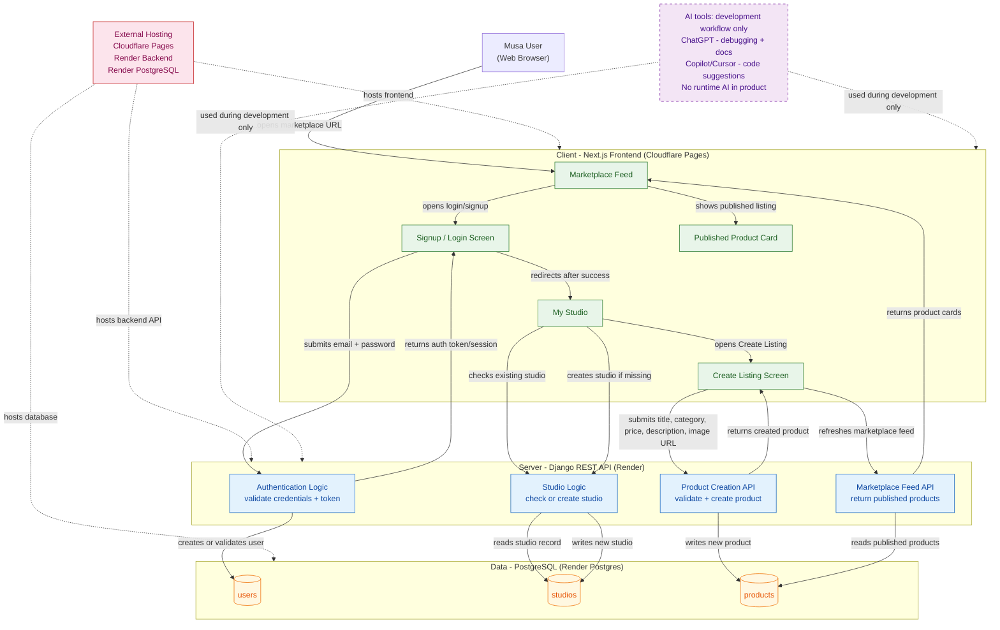

# Architecture Diagram — Source

**Final required file:** `03-build/architecture/architecture-diagram.png`  
**Team:** Nemesis  
**Product:** Musa  
**Date:** 21 May 2026

> This file contains the Mermaid source for the architecture diagram. Export the diagram below to PNG using the Mermaid Live Editor and save the PNG as `architecture-diagram.png` in this folder.

---

## 1. Diagram Goal

```text
This diagram shows how a Musa user authenticates, creates a studio, publishes a handmade product listing, and views it on the marketplace feed across the Sprint 1 system.
```

---

## 2. Required Boxes Included

| Box                        | Included | Notes                     |
| -------------------------- | -------- | ------------------------- |
| User                       | Yes      | Marketplace user          |
| Browser / client app       | Yes      | Next.js frontend          |
| Frontend application       | Yes      | React / Next.js UI        |
| Authentication provider    | Yes      | Django authentication     |
| Backend / server logic     | Yes      | Django REST API           |
| Database                   | Yes      | PostgreSQL                |
| Analytics / event tracking | Deferred | No analytics in Sprint 1  |
| External APIs or services  | Yes      | Render + Cloudflare Pages |
| AI touchpoints             | Yes      | Build workflow only       |

---

## 3. Mermaid Diagram



## 

## 4. Arrow Logic Summary

| Arrow              | Label                      | From                  | To                     |
| ------------------ | -------------------------- | --------------------- | ---------------------- |
| User opens URL     | opens marketplace URL      | User                  | Marketplace Feed       |
| Open auth screen   | opens login/signup         | Marketplace Feed      | Signup/Login Screen    |
| Submit credentials | submits email + password   | Signup/Login Screen   | Authentication Logic   |
| User validation    | creates or validates user  | Authentication Logic  | users table            |
| Auth response      | returns auth response      | Authentication Logic  | Signup/Login Screen    |
| Redirect           | redirects after success    | Signup/Login Screen   | My Studio              |
| Studio check       | checks existing studio     | My Studio             | Studio Creation Logic  |
| Studio read        | reads studio record        | Studio Creation Logic | studios table          |
| Create studio      | creates studio if missing  | My Studio             | Studio Creation Logic  |
| Studio write       | writes new studio          | Studio Creation Logic | studios table          |
| Open listing form  | opens Create Listing       | My Studio             | Create Listing Screen  |
| Product submit     | submits listing data       | Create Listing Screen | Product Creation API   |
| Product validation | validates required fields  | Product Creation API  | Product Creation API   |
| Product write      | writes new product         | Product Creation API  | products table         |
| Product response   | returns created product    | Product Creation API  | Create Listing Screen  |
| Feed refresh       | refreshes marketplace feed | Create Listing Screen | Marketplace Feed API   |
| Product read       | reads published products   | Marketplace Feed API  | products table         |
| Feed response      | returns product cards      | Marketplace Feed API  | Marketplace Feed       |
| Product display    | shows published listing    | Marketplace Feed      | Published Product Card |

---

## 5. AI Annotation

**AI tools exist only in the development workflow. No runtime AI feature exists in Sprint 1.**

- ChatGPT:
  - Deployment troubleshooting
  - Debugging
  - Documentation support

- Copilot / Cursor:
  - Inline code suggestions
  - Boilerplate generation

- Claude Code:
  - Backend/frontend debugging support

No AI API is called during actual user interaction with Musa.

---

## 6. Final Export Check

- [x] Boxes match the written system design
- [x] Arrows are labeled
- [x] Database is visually distinct
- [x] Auth is shown where it happens
- [x] Analytics status is explicitly mentioned
- [x] Diagram is readable at normal zoom
- [x] PNG exported and committed as `architecture-diagram.png`
