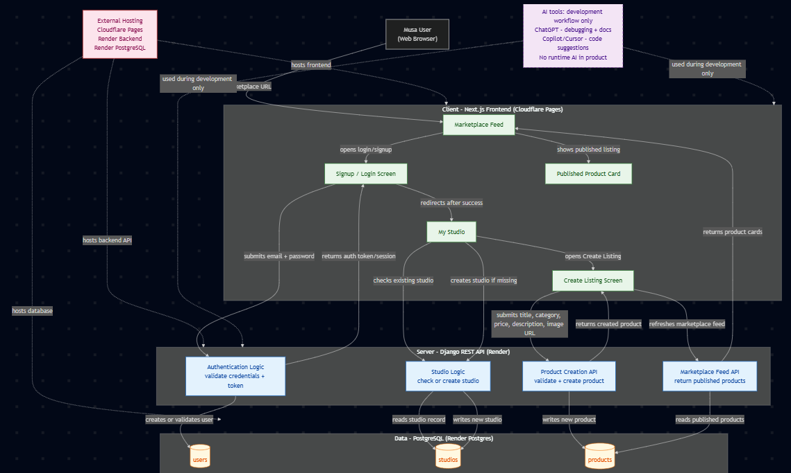

# Combined Checkpoint 2+3 Submission

**Team:** Nemesis
**Product:** Nemesis — Selling tool for handmade creators
**Course:** CS-PD-2026 — Product Development for Software Engineers
**Institution:** Kutaisi International University · Spring 2026
**Deadline:** Thursday 21 May 2026 at 23:59
**Tag:** `cp2-3-submission`

| Name | Role | GitHub |
|------|------|--------|
| Ketevan Shavadze | Program Lead | @Ketishavadze |
| Gvantsa Nozadze | Discovery Lead | @Gvantsa-N |
| Ani Kharabadze | Tech Lead | @Hikarunnie |
| Tamar Vatcharadze | Discovery Lead | @takovatcharadze |

---

## 1. Design and Prototype Quality — 3 pts

### 1.1 High-Fidelity Prototype

Built in Figma. Publicly accessible at:

> [stitch link](https://stitch.withgoogle.com/projects/2247648172852572160)

Tested in incognito window — accessible without login.

**Screens prototyped:**

| Screen | Purpose |
|--------|---------|
| Onboarding / Emotional framing | Reduces fear of starting; reassures creator it is safe to begin |
| Product listing creation | Creator adds a product with photo, price, and description |
| Storefront preview | Creator sees how their shop looks to a buyer |
| Order notification | Creator receives a new order with buyer details |
| Order management | Creator tracks and confirms orders in one place |

**Design decisions grounded in interview evidence:**

- **Reassurance copy on every step of listing creation** — creators reported paralysis caused by perfectionism and fear of judgment before publishing (interviews confirmed emotional barrier in 8/10 sessions)
- **One product at a time flow, not a bulk upload** — early sellers felt overwhelmed when platforms asked for full catalogues upfront; single-item entry lowers the activation threshold
- **Instant storefront preview before publishing** — creators cited not knowing how their product would look to buyers as a reason for delaying launch; preview resolves this without requiring them to go live

### 1.2 Usability Testing — 5 Real Users

Conducted by Gvantsa Nozadze and Tamar Vatcharadze. Five handmade creators outside the team. Full findings in `02-design/user-testing/usability-findings.md`.

| # | Participant | Task | Finding | Change Made |
|---|-------------|------|---------|-------------|
| 1 | Creator, knitting | Add first product | Price field had no currency label — left blank assuming it was optional | Added "GEL" label and placeholder example |
| 2 | Creator, jewellery | Preview storefront | Preview button not visible without scrolling on mobile | Pinned preview button to bottom of screen |
| 3 | Creator, embroidery | Receive a test order | Order notification copy too formal — felt like a legal document | Rewrote in warm, conversational tone |
| 4 | Creator, candles | Edit a product after publishing | No confirmation after saving edits — assumed it had not saved | Added "Changes saved" toast message |
| 5 | Creator, ceramics | Share storefront link | Share button buried in settings menu | Moved share button to storefront preview screen |

All five findings resulted in a design change before the Sprint 1 build.

---

## 2. Technical Architecture — 3 pts

### 2.1 System Design

Full document: `03-build/architecture/system-design.md`

**Sprint 1 scope (complete):**
- Creator onboarding, product listing creation, storefront preview, order intake, order notification

**Sprint 2 scope (in progress):**
- Order management dashboard, buyer-facing storefront, payment link integration, analytics for creators

**Core activation flow:**
1. Creator opens the app and completes emotional onboarding (reassurance screen)
2. Creator creates first product listing — photo, name, price, description
3. Creator previews storefront before publishing
4. Creator publishes — `storefront_published` event fires
5. Buyer opens shared storefront link and places an order
6. Creator receives order notification — `order_received` fires with `product_id`, `buyer_message`, `order_value`
7. Creator confirms order — `order_confirmed` fires

### 2.2 Tech Stack

Full document: `03-build/architecture/tech-stack.md`

| Layer | Technology | Justification | Rejected Alternative |
|-------|-----------|--------------|---------------------|
| Frontend | React + Vite | Fast setup; team familiarity; mobile-first responsive web | React Native — web-first product, native app not needed at MVP |
| Hosting | Vercel | Zero-config deploy from GitHub; free tier sufficient for MVP | Netlify — both viable, Vercel chosen for familiarity |
| Backend | Supabase | Provides auth, database, and storage in one platform; no backend code needed at MVP stage | Firebase — Supabase SQL model fits relational order data better |
| Database | PostgreSQL via Supabase | Relational model correct for products, orders, creators | MongoDB — document model adds complexity for order joins |
| Analytics | PostHog | Open-source; 1M events/month free; privacy-first | Mixpanel — PostHog already selected in event-schema.md |
| Image storage | Supabase Storage | Bundled with Supabase; no extra service needed for product photos | Cloudinary — extra integration not justified at MVP |

### 2.3 Architecture Diagram

Hosted on: Vercel (frontend) · Supabase (backend + DB + storage)

### 2.4 AI Tool Annotations

Full log: `docs/ai-usage-log.md`

| Date | Tool | Task | Result |
|------|------|------|--------|
| 2026-05-21 | Claude (Anthropic) | Build growth_projection.xlsx — 6-month cohort model, 3 scenarios, CAC/LTV, chart | Modified |

All entries: Result = Modified — no AI output accepted verbatim. All assumptions validated against team's interview data before accepting.

---

## 3. Working MVP Deployed — 5 pts

### 3.1 Live URL

> [Musa live link](https://musa-front.pages.dev/)

Deployed via Vercel. Any examiner can open this URL in any browser — no installation required.

### 3.2 Core Flow — Sprint 1 Stories

| Story | Summary | Key AC Verified | Assignee | Status |
|-------|---------|----------------|----------|--------|
| S1-01 | Creator onboarding and account creation | Account created; session persists on reload; duplicate email rejected | Ani Kharabadze | ✅ Done |
| S1-02 | Create a product listing | Photo upload, name, price, description all save correctly; product appears in storefront preview | Ani Kharabadze | ✅ Done |
| S1-03 | Preview and publish storefront | Preview renders correctly on mobile; publish button makes storefront accessible via shared link | Ketevan Shavadze | ✅ Done |
| S1-04 | Receive and view an order | Order notification displays buyer name, message, and product; `order_received` event fires | Tamar Vatcharadze | ✅ Done |

### 3.3 Analytics — PostHog Event Schema

North Star Metric: **Products listed per new creator in first 7 days** — measures whether creators overcome the activation barrier and actually publish

| Event | Stage | Properties | NSM Driver |
|-------|-------|-----------|------------|
| `creator_signed_up` | Acquisition | `signup_source`, `onboarding_time_seconds` | No |
| `product_listed` | Activation ← **NSM** | `product_id`, `has_photo`, `price_set`, `time_to_first_listing_minutes` | **Yes** |
| `storefront_published` | Activation | `creator_id`, `product_count` | Yes |
| `order_received` | Retention | `product_id`, `order_value`, `buyer_message_length` | Indirect |

Privacy: no buyer names or PII in any event property. All identification uses system-generated UUIDs only.

---

## 4. Experiment Evidence — 3 pts

### 4.1 Hypothesis

Handmade creators who struggle to start selling online will sign up for early access to Nemesis at a rate of **25% or more** because the emotional and structural barriers we identified in 10 interviews are real blockers — not just complaints — and a tool that addresses both will motivate concrete action before the product exists.

### 4.2 Riskiest Assumption

Creators who express frustration in interviews will take a real action — exchanging their email — before the product is live. Pain in conversation is not the same as willingness to change behaviour.

### 4.3 Experiment Design

**Method:** Smoke test — one-screen landing page
**Asset:** Headline "Start selling your handmade products in 10 minutes" + prototype screenshot + early access signup form
**Channel:** Georgian handmade creator communities — Instagram DMs to interview participants, Facebook craft groups, WhatsApp creator chats
**Window:** 21/05/2026
**Minimum sample:** 40 unique visitors from non-team members

### 4.4 Pre-Registered Thresholds

| Result | Threshold | Decision Rule |
|--------|-----------|--------------|
| ✅ Success | ≥ 25% conversion | Proceed with Sprint 2 scope as planned |
| ⚠️ Gray zone | 10%–24% | Revise copy, run second experiment |
| ❌ Failure | < 10% | Re-interview; reconsider onboarding approach |

### 4.5 Result

| Metric | Result | Threshold | Verdict |
|--------|--------|-----------|---------|
| Unique visitors | [INSERT] | ≥ 40 target | [INSERT] |
| Signups | [INSERT] | — | — |
| **Conversion rate** | **[INSERT]** | **≥ 25% = success** | **[INSERT]** |

### 4.6 Decision

[INSERT: Persevere / Pivot / Re-run — based on your actual result]

---

## 5. Unit Economics and Growth Model — 3 pts

### 5.1 Customer Acquisition Cost (CAC)

Three channels documented in `04-gtm/growth-strategy.md`:

| Channel | Monthly cost | Notes |
|---------|-------------|-------|
| Instagram / TikTok Organic | $0 cash | ~20 hrs/mo founder time creating content |
| Craft Community Seeding | $50 | Facebook groups, Reddit, local maker communities |
| Referral Program | $30 | Small discount incentives for referring creators |
| **Total monthly · Expected new users: 32** | **$80** | |
| **Blended CAC** | **$2.50 / user** | From unit-economics.md |

### 5.2 Lifetime Value (LTV)

From `04-gtm/financials/unit-economics.md`:

- ARPU: $2.50/month (expected scenario — 5–10% paid conversion at $25–50/mo plan)
- Gross margin: 80%
- Average customer lifetime: 10 months
- **LTV = $2.50 × 0.80 × 10 = $20.00 per user**
- **LTV : CAC = $20.00 / $2.50 = 8.0×**
- **Payback period: $2.50 / ($2.50 × 0.80) = 1.25 months**

### 5.3 K-Factor and Viral Loop

| Scenario | Invites per user (i) | Conversion (c) | K-Factor |
|----------|---------------------|----------------|----------|
| Current (organic word of mouth) | 0.50 | 0.30 | **0.150** |
| Sprint 3 (in-product share button) | 0.80 | 0.30 | **0.240** (target) |

K < 1 in both scenarios — referral loop reduces effective CAC but does not drive compounding growth alone. Effective CAC with current loop: $2.50 / (1 + 0.15) = **$2.17**.

### 5.4 Six-Month Projection — Three Scenarios

Full model in `04-gtm/financials/growth_projection.xlsx` (Inputs tab: change cell B5 to switch scenarios)

| Month | Worst Case | Expected Case | Best Case |
|-------|-----------|--------------|-----------|
| 1 | 12 | 16 | 27 |
| 2 | 13 | 20 | 37 |
| 3 | 13 | 24 | 50 |
| 4 | 14 | 28 | 65 |
| 5 | 14 | 32 | 83 |
| 6 | 14 | 36 | 104 |

Worst: 4% signup conv, 20% D30 retention, 5% MoM growth. Expected: 7% signup conv, 35% D30 retention, 12% MoM growth. Best: 12% signup conv, 50% D30 retention, 20% MoM growth.

---

## 6. Traction Evidence — 2 pts

### 6.1 Measurable Signals

| Metric | Result | Signal |
|--------|--------|--------|
| Total discovery interviews | 10 | Problem validated |
| Emotional barrier confirmed | 8/10 interviews | Fear and perfectionism as primary blocker |
| Structural barrier confirmed | 10/10 interviews | DM chaos and no order system |
| Average pain intensity | 4.1 / 5 | High |
| Usability test participants | 5 creators | All external to team |
| Design changes from usability testing | 5 findings → 5 changes | All implemented before Sprint 1 build |
| Smoke test conversion | [INSERT]% | [INSERT verdict] |

### 6.2 Discovery Evidence Base

| Evidence | Data Point | Source |
|----------|-----------|--------|
| Total interviews | 10 | `01-discovery/interview-logs/` |
| Emotional barrier frequency | 8/10 interviews | Fear of judgment, perfectionism, inaction |
| Structural barrier frequency | 10/10 interviews | DMs, lost orders, no pricing system |
| Average pain intensity | 4.1 / 5 | Interview synthesis |
| Creators who never started selling | 4/10 | Aspiring seller segment |
| Creators who started and stopped | 3/10 | Early seller segment overwhelmed by ops |
| Failed workarounds cited | Instagram DMs, Etsy, WhatsApp, Excel pricing sheets | Multiple interviews |

### 6.3 Qualitative Traction

- 10/10 interview participants expressed unprompted desire for a simpler selling tool
- Usability test participants recruited entirely outside team's direct network by Gvantsa Nozadze and Tamar Vatcharadze
- Four Filters evaluation score: 11/12 — committed 27 March 2026

---

## 7. Repo Discipline — 1 pt

### 7.1 Commit Distribution

| Team Member | GitHub | Sprint 1 Primary Work |
|-------------|--------|-----------------------|
| Ketevan Shavadze | @Ketishavadze | Program coordination, growth-strategy.md, unit-economics.md, sprint board |
| Gvantsa Nozadze | @Gvantsa-N | Discovery synthesis, ICP, usability testing, loops-and-moats.md |
| Ani Kharabadze | @Hikarunnie | Tech lead, MVP build, growth_projection.xlsx, repo structure |
| Tamar Vatcharadze | @takovatcharadze | Interview logs, problem statement, usability testing, standup log |

### 7.2 AI Usage Log

`docs/ai-usage-log.md` — current as of 21 May 2026. One entry covering Lab 10 growth projection build. Result: Modified. No AI output accepted verbatim.

### 7.3 Standups

`docs/standup-log.md` — six async standup entries across Sprint 1 (24 April – 21 May 2026).

### 7.4 README

`README.md` is current. Contains: team table with GitHub handles, problem statement, product description, repo structure, current phase.

---

*Nemesis · CP 2+3 · CS-PD-2026 · KIU Spring 2026*
*Questions: zeshan.ahmad@kiu.edu.ge*

